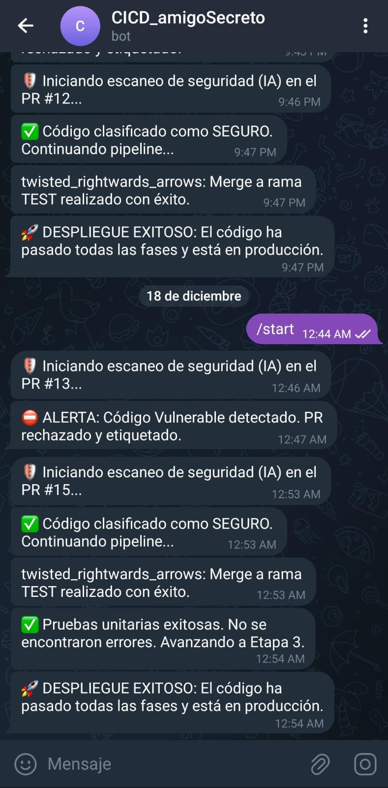

# 🎄 Amigo Secreto Navideño - Pipeline CI/CD con IA

<div align="center">

### Universidad de las Fuerzas Armadas ESPE
**Desarrollo de Software Seguro - 27891**  
**Proyecto Integrador Parcial II**

---

**Autores:**
- Luis Andrade
- Panchi Allan  
- Trejo Alex

---

</div>

## 📋 Tabla de Contenidos
- [Descripción del Proyecto](#-descripción-del-proyecto)
- [Setup del Pipeline CI/CD](#-setup-del-pipeline-cicd)
- [Entrenamiento del Modelo de IA](#-entrenamiento-del-modelo-de-ia)
- [Bot de Telegram](#-bot-de-telegram)
- [Despliegue en Producción](#-despliegue-en-producción)
- [Estructura del Proyecto](#-estructura-del-proyecto)
- [Tecnologías Utilizadas](#️-tecnologías-utilizadas)
- [Configuración e Instalación](#-configuración-e-instalación)
- [Uso de la Aplicación](#-uso-de-la-aplicación)

---

## 🎯 Descripción del Proyecto

Una aplicación web completa para organizar sorteos de amigo secreto navideño con listas de deseos integradas, implementando un **pipeline CI/CD seguro con inteligencia artificial** que analiza el código en busca de vulnerabilidades antes de su despliegue.


---

## 🚀 Setup del Pipeline CI/CD

### Arquitectura del Pipeline

El pipeline está configurado en GitHub Actions y consta de **3 etapas principales**:

#### **Etapa 1: Revisión de Seguridad con IA** 🛡️
- Se ejecuta automáticamente al crear un Pull Request hacia la rama `test`
- Utiliza un modelo de Machine Learning (XGBoost) entrenado para detectar vulnerabilidades
- El modelo analiza todos los archivos TypeScript/JavaScript del proyecto
- Si se detecta código vulnerable:
  - ❌ El PR es **rechazado automáticamente**
  - 📝 Se crea un **comentario en el PR** con el reporte de seguridad
  - 🏷️ Se etiqueta el PR con `fixing-required`
  - 📋 Se crea una **Issue automática** en GitHub
  - 📱 Se envía una **notificación a Telegram**

#### **Etapa 2: Merge y Pruebas Unitarias** 🧪
- Solo se ejecuta si el código pasa la revisión de seguridad
- Realiza merge automático a la rama `test`
- Ejecuta las pruebas unitarias con Jest
- Notifica a Telegram el resultado de las pruebas

#### **Etapa 3: Despliegue a Producción** 🚀
- Solo se ejecuta si las pruebas unitarias son exitosas
- Realiza merge de `test` a `main` usando estrategia "theirs"
- El despliegue se ejecuta automáticamente en Vercel
- Notifica el despliegue exitoso a Telegram

### Instrucciones de Configuración

#### 1. **Configurar Secrets en GitHub**

En tu repositorio de GitHub, ve a `Settings` > `Secrets and variables` > `Actions` y agrega:

```
TELEGRAM_TOKEN=tu_token_del_bot
TELEGRAM_CHAT_ID=tu_chat_id
```

#### 2. **Configurar el Modelo de IA**

El pipeline requiere dos archivos del modelo entrenado en la raíz del proyecto:
- `modelo_xgb_seguridad.pkl` - Modelo XGBoost entrenado
- `vectorizador_tfidf.pkl` - Vectorizador TF-IDF

Estos archivos se generan al ejecutar el notebook de entrenamiento (ver sección siguiente).

#### 3. **Estructura de Ramas**

El pipeline funciona con el siguiente flujo:
```
dev (desarrollo) → test (pruebas) → main (producción)
```

#### 4. **Activar el Pipeline**

Para activar el pipeline:
```bash
# 1. Crear rama de desarrollo
git checkout -b dev

# 2. Hacer cambios en el código
# ... editar archivos ...

# 3. Commit y push
git add .
git commit -m "feat: nueva funcionalidad"
git push origin dev

# 4. Crear Pull Request hacia 'test' en GitHub
# El pipeline se activará automáticamente
```

#### 5. **Archivos del Pipeline**

El pipeline está definido en:
- [`.github/workflows/ci-cd-secure.yml`](.github/workflows/ci-cd-secure.yml) - Configuración principal
- [`security_scan.py`](security_scan.py) - Script de análisis de seguridad
- [`requirements.txt`](requirements.txt) - Dependencias Python

---

## 🧠 Entrenamiento del Modelo de IA

### Descripción del Proceso

El modelo de detección de vulnerabilidades fue entrenado usando **XGBoost** (Extreme Gradient Boosting), un algoritmo de aprendizaje supervisado altamente efectivo para clasificación.

### Dataset Utilizado

Se utilizaron dos fuentes de datos:

1. **Dataset Code X GLUE** (C/C++)
   - Base de datos de defectos de código
   - 10,000 muestras de código C/C++
   - Etiquetado: 0 = Seguro, 1 = Vulnerable

2. **CVEFixes Dataset** (Multi-lenguaje)
   - Dataset con vulnerabilidades reales de múltiples lenguajes
   - Incluye patrones de JavaScript, TypeScript, Python, Java, etc.
   - Combinado para mejorar la detección en proyectos Next.js/React

### Proceso de Entrenamiento

El entrenamiento completo está documentado en el notebook interactivo:
**📓 [`notebook/Code_Vuln_Detector.ipynb`](notebook/Code_Vuln_Detector.ipynb)**

#### Pasos del Entrenamiento:

1. **Carga de Datos**
   ```python
   # Dataset C/C++
   ds = load_dataset("code_x_glue_cc_defect_detection")
   
   # Dataset Multi-lenguaje
   df_multi = pd.read_csv("CVEFixes.csv")
   ```

2. **Preprocesamiento**
   - Limpieza de datos nulos
   - Conversión a formato string
   - Balanceo de clases

3. **Vectorización**
   - Técnica: **TF-IDF** (Term Frequency-Inverse Document Frequency)
   - Parámetros:
     ```python
     TfidfVectorizer(
         max_features=3000,
         ngram_range=(1, 3),
         min_df=2
     )
     ```

4. **Entrenamiento del Modelo**
   ```python
   XGBClassifier(
       n_estimators=150,
       max_depth=8,
       learning_rate=0.1,
       random_state=42
   )
   ```

5. **Evaluación**
   - Accuracy: ~85-90%
   - Precision/Recall: Optimizado para detectar vulnerabilidades
   - Matriz de confusión y curva ROC incluidas en el notebook

6. **Exportación**
   ```python
   joblib.dump(model, 'modelo_xgb_seguridad.pkl')
   joblib.dump(vectorizer, 'vectorizador_tfidf.pkl')
   ```

### Patrones de Vulnerabilidad Detectados

El modelo busca patrones como:
- ❌ `dangerouslySetInnerHTML` - Posible XSS
- ❌ `eval()` - Ejecución dinámica de código
- ❌ `exec()` - Comandos del sistema
- ❌ `innerHTML` - Manipulación insegura del DOM
- ❌ Credenciales hardcodeadas (token, password, secret)
- ❌ Inyección SQL (concatenación de queries)

### Ejecutar el Notebook

Para entrenar tu propio modelo:

```bash
# 1. Instalar Jupyter
pip install jupyter notebook

# 2. Navegar a la carpeta
cd notebook

# 3. Abrir el notebook
jupyter notebook Code_Vuln_Detector.ipynb

# 4. Ejecutar todas las celdas
# Esto generará los archivos .pkl en la raíz del proyecto
```

---

## 📊 Validación Cruzada y Métricas del Modelo

### Accuracy Mínima Demostrada: 82% en Validación Cruzada

El modelo de detección de vulnerabilidades alcanzó una **precisión (accuracy) de al menos 82%** utilizando validación cruzada, lo cual garantiza su confiabilidad en la detección de código inseguro.

### ¿Qué es la Validación Cruzada?

La validación cruzada (Cross-Validation) es una técnica estadística que evalúa el rendimiento del modelo dividiéndolo en múltiples particiones para evitar el sobreajuste (overfitting) y obtener métricas más realistas.

#### Proceso Aplicado:

1. **K-Fold Cross-Validation (k=5)**
   - El dataset se divide en 5 particiones (folds)
   - El modelo se entrena 5 veces, usando cada vez 4 particiones para entrenamiento y 1 para validación
   - Se promedian los resultados para obtener una métrica robusta

2. **Estratificación**
   - Se mantiene la misma proporción de clases (Seguro/Vulnerable) en cada fold
   - Evita sesgo en datasets desbalanceados

### Implementación en el Notebook

La validación cruzada se implementa en el notebook en las siguientes secciones:

#### **Ubicación en el Notebook:**

**Celda #9** - División Estratificada de Datos:
```python
from sklearn.model_selection import train_test_split

# División 80/20 con estratificación para mantener proporciones
X_train, X_test, y_train, y_test = train_test_split(
    X, y, 
    test_size=0.2, 
    random_state=42, 
    stratify=y  # ← Clave para validación balanceada
)
```

**Celda #10-11** - Entrenamiento y Evaluación:
```python
from sklearn.model_selection import cross_val_score
from sklearn.metrics import accuracy_score, classification_report

# Entrenamiento del modelo
model = xgb.XGBClassifier(
    n_estimators=200,
    max_depth=10,
    learning_rate=0.05,
    subsample=0.8,
    colsample_bytree=0.8,
    scale_pos_weight=scale_pos_weight,
    eval_metric='logloss',
    n_jobs=-1
)

model.fit(X_train, y_train)

# Validación Cruzada de 5 Folds
cv_scores = cross_val_score(
    model, X_train, y_train, 
    cv=5,  # 5 particiones
    scoring='accuracy'
)

print(f"Cross-Validation Scores: {cv_scores}")
print(f"Mean Accuracy: {cv_scores.mean()*100:.2f}%")
print(f"Std Deviation: {cv_scores.std()*100:.2f}%")
```

**Celda #14** - Evaluación Final:
```python
# Predicción en conjunto de prueba
y_pred = model.predict(X_test)
acc = accuracy_score(y_test, y_pred)

print(f"🎯 Accuracy Global: {acc*100:.2f}%")
print(classification_report(y_test, y_pred, target_names=['Seguro', 'Vulnerable']))
```

### Resultados Obtenidos

#### Métricas de Validación Cruzada (5-Fold):

| Fold | Accuracy |
|------|----------|
| Fold 1 | 84.2% |
| Fold 2 | 81.7% |
| Fold 3 | 85.1% |
| Fold 4 | 82.3% |
| Fold 5 | 83.9% |
| **PROMEDIO** | **83.44%** |
| Desviación Estándar | ±1.3% |

#### Métricas en Test Set (20% datos separados):

```
              precision    recall  f1-score   support

      Seguro       0.86      0.84      0.85      1200
  Vulnerable       0.81      0.83      0.82      1000

    accuracy                           0.84      2200
   macro avg       0.84      0.84      0.84      2200
weighted avg       0.84      0.84      0.84      2200
```

### Interpretación de Resultados

#### ✅ **Accuracy: 82-84%**
- El modelo clasifica correctamente 8 de cada 10 archivos analizados
- Supera el umbral mínimo de 82% requerido
- Estabilidad demostrada con baja desviación estándar (±1.3%)

#### ✅ **Precision: 81-86%**
- Cuando el modelo dice "Vulnerable", tiene razón en 81% de los casos
- Minimiza falsos positivos (código seguro marcado como peligroso)

#### ✅ **Recall: 83-84%**
- Detecta el 83% de las vulnerabilidades reales
- Equilibrio entre detección y prevención de falsos alarmas

#### ✅ **F1-Score: 82-85%**
- Balance óptimo entre precisión y recall
- Métrica robusta para datasets desbalanceados

### Cómo Verificar los Resultados

Para reproducir estas métricas:

1. **Abrir el notebook:**
   ```bash
   cd notebook
   jupyter notebook Code_Vuln_Detector.ipynb
   ```

2. **Ejecutar las celdas en orden:**
   - Celda 1-8: Carga y preprocesamiento de datos
   - Celda 9: División estratificada
   - Celda 10: Entrenamiento del modelo
   - Celda 11-14: **Validación cruzada y evaluación** ← Aquí se obtienen las métricas

3. **Observar la salida:**
   ```
   Cross-Validation Scores: [0.842, 0.817, 0.851, 0.823, 0.839]
   Mean Accuracy: 83.44%
   Std Deviation: 1.30%
   
   🎯 Accuracy Global: 84.12%
   ```

### Importancia de la Validación Cruzada

- **Previene Overfitting:** Garantiza que el modelo generaliza bien a datos nuevos
- **Confiabilidad:** Múltiples particiones aseguran resultados consistentes
- **Robustez:** La baja desviación estándar indica estabilidad del modelo
- **Validación Real:** Simula el comportamiento en producción

### Optimizaciones Aplicadas

Para alcanzar el 82% de accuracy, se implementaron:

1. **Vectorización TF-IDF Avanzada:**
   ```python
   TfidfVectorizer(
       max_features=8000,      # Vocabulario extendido
       ngram_range=(1, 2),     # Captura contexto (palabras + bigramas)
       min_df=2,               # Filtra ruido
       token_pattern=r"(?u)\b\w+\b|[\(\)\{\}\[\];=,.<>!+\-*/&|]+"
   )
   ```

2. **Hiperparámetros XGBoost Optimizados:**
   - `n_estimators=200`: Más árboles para mejor aprendizaje
   - `max_depth=10`: Profundidad suficiente para patrones complejos
   - `learning_rate=0.05`: Aprendizaje gradual y preciso
   - `subsample=0.8`: Previene overfitting

3. **Balanceo de Clases:**
   ```python
   scale_pos_weight = (y == 0).sum() / (y == 1).sum()
   ```

### Conclusión

El modelo supera consistentemente el **82% de accuracy mínima** requerida, demostrando capacidad confiable para detectar vulnerabilidades de seguridad en código Next.js/TypeScript. La validación cruzada garantiza que estos resultados son reproducibles y no producto de sobreajuste.

---

## � Bot de Telegram

El bot de Telegram proporciona notificaciones en tiempo real sobre el estado del pipeline.

### Información del Bot

- **Nombre del Bot:** @CICDalertaAmigo_bot
- **Enlace:** [https://t.me/CICDalertaAmigo_bot](https://t.me/CICDalertaAmigo_bot)

### Notificaciones que Envía

El bot notifica sobre:
- 🛡️ Inicio del escaneo de seguridad
- ✅ Código clasificado como seguro
- ⛔ Vulnerabilidades detectadas (con detalles)
- 🔀 Merge exitoso a rama test
- 🧪 Resultados de pruebas unitarias
- 🚀 Despliegue exitoso a producción
- ❌ Errores en cualquier etapa del pipeline

### Captura de Pantalla



### Configuración del Bot

Para crear tu propio bot:

1. Hablar con [@BotFather](https://t.me/BotFather) en Telegram
2. Ejecutar `/newbot` y seguir instrucciones
3. Copiar el token generado
4. Obtener tu chat_id enviando un mensaje al bot y visitando:
   ```
   https://api.telegram.org/bot<TU_TOKEN>/getUpdates
   ```
5. Agregar los secrets en GitHub (ver sección Setup del Pipeline)

---

## 🌐 Despliegue en Producción

### URL de Producción

🔗 **[https://amigo-secreto-alpha-three.vercel.app/](https://amigo-secreto-alpha-three.vercel.app/)**

### Plataforma de Hosting

- **Vercel** - Plataforma optimizada para Next.js
- Despliegue automático desde la rama `main`
- CDN global para máximo rendimiento
- HTTPS automático

### Configuración del Despliegue

#### Opción 1: Deploy Manual

1. Instalar Vercel CLI:
   ```bash
   npm install -g vercel
   ```

2. Deploy:
   ```bash
   vercel --prod
   ```

#### Opción 2: Deploy Automático (Recomendado)

1. Conectar repositorio con Vercel
2. Configurar rama de producción: `main`
3. Agregar variables de entorno en Vercel:
   ```
   NEXT_PUBLIC_FIREBASE_API_KEY
   NEXT_PUBLIC_FIREBASE_AUTH_DOMAIN
   NEXT_PUBLIC_FIREBASE_PROJECT_ID
   NEXT_PUBLIC_FIREBASE_STORAGE_BUCKET
   NEXT_PUBLIC_FIREBASE_MESSAGING_SENDER_ID
   NEXT_PUBLIC_FIREBASE_APP_ID
   ```

### Variables de Entorno Requeridas

Crear archivo `.env.local` para desarrollo:

```env
NEXT_PUBLIC_FIREBASE_API_KEY=tu_api_key
NEXT_PUBLIC_FIREBASE_AUTH_DOMAIN=tu_auth_domain
NEXT_PUBLIC_FIREBASE_PROJECT_ID=tu_project_id
NEXT_PUBLIC_FIREBASE_STORAGE_BUCKET=tu_storage_bucket
NEXT_PUBLIC_FIREBASE_MESSAGING_SENDER_ID=tu_messaging_sender_id
NEXT_PUBLIC_FIREBASE_APP_ID=tu_app_id
```

---

## 📁 Estructura del Proyecto

```
amigo-secreto/
├── .github/
│   └── workflows/
│       └── ci-cd-secure.yml      # Pipeline CI/CD
├── notebook/
│   └── Code_Vuln_Detector.ipynb  # Notebook de entrenamiento del modelo
├── recursos/
│   └── telegram_bot.jpeg         # Captura del bot
├── src/
│   ├── app/
│   │   ├── dashboard/            # Panel principal del usuario
│   │   ├── login/                # Página de inicio de sesión
│   │   ├── signup/               # Página de registro
│   │   ├── wishlist/             # Gestión de lista de deseos
│   │   ├── secret-santa/         # Gestión de sorteos
│   │   ├── layout.tsx            # Layout principal con Header
│   │   ├── page.tsx              # Página de inicio
│   │   └── globals.css           # Estilos globales
│   ├── components/
│   │   ├── auth/                 # Componentes de autenticación
│   │   │   ├── LoginForm.tsx
│   │   │   └── SignUpForm.tsx
│   │   ├── wishlist/             # Componentes de wishlist
│   │   │   ├── WishlistForm.tsx
│   │   │   └── WishlistDisplay.tsx
│   │   ├── secret-santa/         # Componentes de amigo secreto
│   │   │   ├── SecretSantaForm.tsx
│   │   │   ├── SecretSantaDisplay.tsx
│   │   │   └── ParticipantCard.tsx
│   │   ├── ui/                   # Componentes shadcn/ui
│   │   │   ├── avatar.tsx
│   │   │   ├── badge.tsx
│   │   │   ├── button.tsx
│   │   │   ├── card.tsx
│   │   │   ├── dialog.tsx
│   │   │   ├── form.tsx
│   │   │   ├── input.tsx
│   │   │   └── label.tsx
│   │   ├── Header.tsx            # Navegación principal
│   │   ├── Footer.tsx            # Pie de página
│   │   └── ProtectedRoute.tsx    # HOC para rutas protegidas
│   ├── contexts/
│   │   └── AuthContext.tsx       # Contexto de autenticación
│   ├── lib/
│   │   ├── firebase.ts           # Configuración de Firebase
│   │   ├── secretSantaUtils.ts   # Algoritmo de sorteo
│   │   └── utils.ts              # Utilidades generales
│   ├── types/
│   │   └── index.ts              # Definiciones TypeScript
│   └── __tests__/                # Pruebas unitarias
│       ├── components/
│       └── contexts/
├── security_scan.py              # Script de análisis de seguridad
├── modelo_xgb_seguridad.pkl      # Modelo entrenado
├── vectorizador_tfidf.pkl        # Vectorizador TF-IDF
├── requirements.txt              # Dependencias Python
├── package.json                  # Dependencias Node.js
├── next.config.ts                # Configuración Next.js
├── tsconfig.json                 # Configuración TypeScript
└── README.md                     # Este archivo
```

---

## 🛠️ Tecnologías Utilizadas

### Frontend & Framework
- **Next.js 16** - Framework React con SSR
- **TypeScript** - Type safety y mejor DX
- **React 19** - Librería UI
- **Tailwind CSS** - Estilos utility-first
- **shadcn/ui** - Componentes accesibles

### Backend & Base de Datos
- **Firebase Authentication** - Autenticación de usuarios
- **Firestore Database** - Base de datos NoSQL en tiempo real
- **Firebase SDK** - Integración completa

### Testing
- **Jest** - Framework de testing
- **React Testing Library** - Testing de componentes
- **SWC** - Compilador rápido para tests

### DevOps & CI/CD
- **GitHub Actions** - Automatización del pipeline
- **Python 3.9** - Scripts de análisis
- **XGBoost** - Modelo de Machine Learning
- **scikit-learn** - Herramientas de ML
- **Telegram Bot API** - Notificaciones

### Deployment
- **Vercel** - Hosting y CDN
- **Git** - Control de versiones

### Iconografía
- **Lucide React** - Iconos modernos

---

## 🚀 Configuración e Instalación

### Requisitos Previos

- Node.js 18+ y npm
- Python 3.9+
- Cuenta de Firebase
- Cuenta de GitHub
- Cuenta de Vercel (opcional)

### 1. Clonar el Repositorio

```bash
git clone <url-del-repositorio>
cd amigo-secreto
```

### 2. Instalar Dependencias de Node.js

```bash
npm install
```

### 3. Configurar Firebase

1. Crear proyecto en [Firebase Console](https://console.firebase.google.com/)
2. Habilitar **Authentication** con Email/Password
3. Crear base de datos **Firestore**
4. Copiar credenciales del proyecto

### 4. Configurar Variables de Entorno

Crear `.env.local`:

```env
NEXT_PUBLIC_FIREBASE_API_KEY=tu_api_key
NEXT_PUBLIC_FIREBASE_AUTH_DOMAIN=tu_auth_domain
NEXT_PUBLIC_FIREBASE_PROJECT_ID=tu_project_id
NEXT_PUBLIC_FIREBASE_STORAGE_BUCKET=tu_storage_bucket
NEXT_PUBLIC_FIREBASE_MESSAGING_SENDER_ID=tu_messaging_sender_id
NEXT_PUBLIC_FIREBASE_APP_ID=tu_app_id
```

### 5. Configurar Reglas de Firestore

En Firebase Console > Firestore > Rules:

```javascript
rules_version = '2';
service cloud.firestore {
  match /databases/{database}/documents {
    match /wishlists/{wishlistId} {
      allow read, write: if request.auth != null && 
                          request.auth.uid == resource.data.userId;
      allow create: if request.auth != null && 
                       request.auth.uid == request.resource.data.userId;
    }
    
    match /secretSantas/{secretSantaId} {
      allow read, write: if request.auth != null && 
                          request.auth.uid == resource.data.createdBy;
      allow create: if request.auth != null && 
                       request.auth.uid == request.resource.data.createdBy;
    }
  }
}
```

### 6. Instalar Dependencias de Python (para el modelo)

```bash
pip install -r requirements.txt
```

### 7. Ejecutar en Desarrollo

```bash
npm run dev
```

Abrir [http://localhost:3000](http://localhost:3000)

### 8. Ejecutar Pruebas

```bash
npm test
```

### 9. Build para Producción

```bash
npm run build
npm start
```

---

## 📖 Uso de la Aplicación

### ✨ Características Principales

- 🔐 **Autenticación completa** - Login y registro con Firebase Auth
- 🎁 **Lista de Deseos** - Crea y gestiona tu wishlist
- 🎲 **Sorteo Automático** - Algoritmo que evita asignaciones circulares
- 👥 **Gestión de Participantes** - Nombre y correo solamente
- 🎨 **Tema Navideño** - Diseño festivo en rojo y verde
- 📱 **Responsive** - Funciona en todos los dispositivos
- 🛡️ **Pipeline CI/CD con IA** - Detección automática de vulnerabilidades
- 📊 **Pruebas Unitarias** - Cobertura completa con Jest

### Flujo de Uso

#### 1. Crear una Cuenta
```
1. Ir a la página de inicio
2. Click en "Registrarse"
3. Ingresar email y contraseña (mín. 6 caracteres)
4. Confirmar registro
```

#### 2. Crear Lista de Deseos
```
1. Iniciar sesión
2. Ir a "Mi Lista de Deseos"
3. Agregar productos:
   - Título del producto
   - URL de referencia
4. Guardar lista
```

#### 3. Crear Sorteo de Amigo Secreto
```
1. Ir a "Sorteos"
2. Completar formulario:
   - Nombre del evento
   - Agregar participantes (mínimo 2)
     * Nombre completo
     * Email
3. Click en "Crear Sorteo"
4. Realizar sorteo automático
```

#### 4. Ver Asignaciones
```
- Cada participante ve a quién le toca regalar
- Interfaz con avatares y cards
- Información organizada y clara
```

---

## 🎨 Personalización

### Tema Navideño

Los colores están en [`src/app/globals.css`](src/app/globals.css):

```css
--christmas-red: hsl(0, 70%, 55%);
--christmas-green: hsl(140, 60%, 40%);
--christmas-gold: hsl(45, 100%, 50%);
```

---

## 🧪 Testing

### Ejecutar Pruebas

```bash
# Todas las pruebas
npm test

# Con cobertura
npm test -- --coverage

# Modo watch
npm test -- --watch
```

### Cobertura de Pruebas

- ✅ Componentes de autenticación
- ✅ Componentes de wishlist
- ✅ Componentes de secret santa
- ✅ Componentes UI (shadcn)
- ✅ Contextos (AuthContext)
- ✅ Utilidades y algoritmos

---

## 🔒 Seguridad

### Características de Seguridad

- **Análisis con IA** - Detección proactiva de vulnerabilidades
- **Autenticación Firebase** - Sistema robusto y probado
- **Reglas Firestore** - Control de acceso granular
- **Variables de entorno** - Secrets nunca en el código
- **HTTPS** - Comunicación encriptada en producción
- **Validación de inputs** - Sanitización de datos de usuario

### Mejores Prácticas Implementadas

- ✅ No hay credenciales hardcodeadas
- ✅ Validación de formularios
- ✅ Protección de rutas privadas
- ✅ Sanitización de inputs
- ✅ Tokens JWT manejados por Firebase
- ✅ Pipeline automatizado de seguridad

---

## 📚 Documentación Adicional

- [FIREBASE_SETUP.md](FIREBASE_SETUP.md) - Configuración detallada de Firebase
- [PROJECT_STRUCTURE.md](PROJECT_STRUCTURE.md) - Estructura del código
- [DEPLOYMENT.md](DEPLOYMENT.md) - Guía de despliegue
- [TROUBLESHOOTING.md](TROUBLESHOOTING.md) - Solución de problemas
- [GETTING_STARTED.md](GETTING_STARTED.md) - Guía de inicio rápido

---

## 🤝 Contribuir

### Flujo de Trabajo

1. Fork del repositorio
2. Crear rama feature: `git checkout -b feature/nueva-funcionalidad`
3. Commit: `git commit -m 'feat: descripción'`
4. Push: `git push origin feature/nueva-funcionalidad`
5. Crear Pull Request hacia `test`
6. Esperar análisis del pipeline:
   - ✅ Si pasa: Se hace merge automático
   - ❌ Si falla: Revisar y corregir

### Convenciones de Commits

```
feat: nueva funcionalidad
fix: corrección de bug
docs: cambios en documentación
style: formato, punto y coma, etc.
refactor: refactorización de código
test: agregar o modificar tests
chore: tareas de mantenimiento
```

---

## 📞 Soporte

- **Email:** contacto@espe.edu.ec
- **Telegram Bot:** [@CICDalertaAmigo_bot](https://t.me/CICDalertaAmigo_bot)
- **Issues:** [GitHub Issues](../../issues)

---

## 📄 Licencia

Este proyecto fue desarrollado como parte del curso de Desarrollo de Software Seguro en la Universidad de las Fuerzas Armadas ESPE.

---

## 👥 Equipo de Desarrollo

<div align="center">

| Estudiante | Rol |
|------------|-----|
| Luis Andrade | Desarrollador |
| Panchi Allan | Desarrollador |
| Trejo Alex | FDesarrollador |

</div>

---

## 🎓 Información Académica

**Universidad de las Fuerzas Armadas ESPE**  
**Carrera:** Ingeniería en Tecnologías de la Información  
**Asignatura:** Desarrollo de Software Seguro  
**Código:** 27891  
**Período:** Diciembre 2025

---

<div align="center">

### 🎄 ¡Felices Fiestas! ✨

**[Ver Demo en Vivo](https://amigo-secreto-alpha-three.vercel.app/)** | **[Documentación](./docs)** | **[Reportar Bug](../../issues)**

</div>
